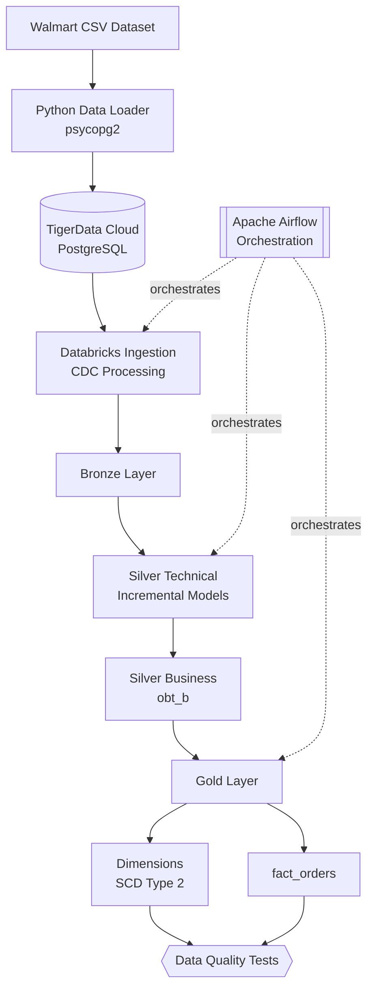

# 🛒 Walmart Data Engineering Project

An end-to-end data engineering pipeline built with **Apache Airflow**, **dbt**, **Azure Databricks**, and **TigerData Cloud**.

It takes raw Walmart sales data and turns it into clean, analytics-ready tables using the **Medallion Architecture** (Bronze → Silver → Gold), with incremental loads, CDC, SCD Type 2 history, automated data quality tests, and Spark performance tuning.

---

## 📑 Table of Contents

- [What This Project Does](#-what-this-project-does)
- [Key Features](#-key-features)
- [Architecture](#-architecture)
- [Tech Stack](#-tech-stack)
- [Data Source and Ingestion](#-data-source-and-ingestion)
- [Pipeline Steps](#-pipeline-steps)
- [Data Modeling](#-data-modeling)
- [Data Quality](#-data-quality)
- [Delta Lake Experiments](#-delta-lake-experiments)
- [Spark Optimization](#-spark-optimization)
- [Airflow Monitoring](#-airflow-monitoring)
- [Project Structure](#-project-structure)
- [Getting Started](#-getting-started)
- [CI/CD](#-cicd)
- [Security](#-security)
- [Project Status](#-project-status)
- [Author](#-author)

---

## 🎯 What This Project Does

1. **Loads** six Walmart CSV files (customers, employees, orders, order items, products, stores) into a PostgreSQL database on TigerData Cloud using a Python script.
2. **Orchestrates** the whole workflow with Apache Airflow.
3. **Ingests and processes** the data in Azure Databricks, including CDC (Change Data Capture).
4. **Transforms** it with dbt through Bronze, Silver, and Gold layers.
5. **Models** the final data as dimension tables (with full history via SCD Type 2) and a fact table.
6. **Validates** everything with automated dbt tests.

---

## ✨ Key Features

| Area | What's included |
|---|---|
| **Pipeline** | End-to-end flow using Airflow, dbt, and Databricks |
| **Source database** | PostgreSQL hosted on TigerData Cloud |
| **Ingestion** | Python CSV loader (`psycopg2`) and Databricks CDC processing |
| **Architecture** | Medallion: Bronze, Silver, and Gold layers |
| **Transformations** | Incremental dbt models |
| **Business modeling** | `obt_b`, a business-ready table at the order-item grain |
| **History tracking** | SCD Type 2 dimensions built with dbt snapshots |
| **Fact modeling** | `fact_orders` with historical (point-in-time) dimension lookups |
| **Testing** | Automated dbt data quality tests |
| **Delta Lake** | Time travel and Change Data Feed experiments |
| **Performance** | Spark query plan analysis and optimization |
| **Monitoring** | Airflow email alerts for task failures and DAG success |
| **Deployment** | Docker-based, with Git/GitHub version control |

---

## 🏗 Architecture



Airflow controls task order and dependencies. Databricks handles ingestion and processing. dbt handles transformations, snapshots, and tests.

---

## 🧰 Tech Stack

| Technology | Purpose |
|---|---|
| Python | CSV ingestion and data loading |
| psycopg2 | PostgreSQL connectivity |
| TigerData Cloud | Managed PostgreSQL source database |
| Apache Airflow 3 | Workflow orchestration |
| Docker Compose | Containerized deployment |
| Azure Databricks | Data ingestion and processing |
| Databricks SDK | Databricks integration |
| Delta Lake | Storage, time travel, and CDC |
| dbt | SQL transformations, snapshots, and testing |
| PySpark | Distributed data processing |
| Git / GitHub | Version control and code hosting |

---

## 📥 Data Source and Ingestion

**Datasets (6 CSV files):** Customers, Employees, Orders, Order Items, Products, Stores.

The script `load_walmart_data.py` uses `psycopg2` to load these files into the `raw` schema of a PostgreSQL database on TigerData Cloud.

**Migration note:** The source database was originally hosted on Ghost, then migrated to TigerData. All six tables (**42,796 rows** in total) were restored and validated against the original row counts.

> ⚠️ The Python loader is for the **initial load only**. After that, ingestion and processing are handled by Databricks.

---

## 🔄 Pipeline Steps

| # | Step | What happens |
|---|---|---|
| 1 | **Source data** | Walmart CSV files provide the raw datasets |
| 2 | **Data loading** | Python loads the CSVs into TigerData PostgreSQL |
| 3 | **Data ingestion** | Databricks ingests source data and processes CDC changes |
| 4 | **Source freshness** | Checks that source data is up to date |
| 5 | **Silver technical** | Incremental transformations on the source tables |
| 6 | **Data quality** | dbt tests validate the transformed data |
| 7 | **Silver business** | Builds `obt_b`, one row per order item |
| 8 | **Ephemeral models** | Intermediate transformations for downstream models |
| 9 | **Snapshots** | dbt snapshots capture historical changes |
| 10 | **Gold dimensions** | Builds SCD Type 2 dimension tables |
| 11 | **Gold fact** | Builds `fact_orders` with historical dimension lookups |
| 12 | **Final validation** | Runs data quality tests on the resulting models |

Airflow manages the task dependencies and execution order for all of these.

---

## 🧱 Data Modeling

The project follows the **Medallion Architecture**:

### 🥉 Bronze: raw ingested data
Stores ingested source data in Databricks. This is the starting point for all downstream transformations.

### 🥈 Silver: cleaned and business-ready data

**Silver Technical** contains incremental dbt models for each source entity: Customers, Employees, Orders, Order Items, Products, and Stores.

**Silver Business** contains `obt_b`, a business-oriented table that combines the relevant source entities. Its grain is **one row per order item**, and it feeds the dimensional and fact models.

### 🥇 Gold: analytics-ready models

**Dimensions**

- `dim_customers`
- `dim_employees`
- `dim_orders`
- `dim_products`
- `dim_stores`

Dimensions use dbt snapshots to keep history with **SCD Type 2**. Each version has a validity period, so a fact record can point to the dimension version that was correct at that time.

**Fact table**

`fact_orders` stores order-item-level records. It uses temporal joins, matching each fact to the dimension version valid at the time of the order.

---

## ✅ Data Quality

dbt tests check the correctness and consistency of the data. They cover:

- Fact table grain and uniqueness
- Dimension validity and overlapping historical records
- Exactly one current record per customer in the customer dimension
- Temporal consistency between facts and dimensions
- Order total reconciliation
- Business table grain

---

## 🔬 Delta Lake Experiments

Hands-on experiments to explore Delta Lake:

- **Time travel:** query previous versions of a table
- **Change Data Feed (CDF):** inspect row-level changes (enabled on the customers technical table)
- **Schema evolution:** automatic schema merging
- **Table history:** analyzing the Delta history log
- **File layout and optimization**

---

## ⚡ Spark Optimization

Experiments used Databricks query plans and query profiles to study:

- Column pruning
- Predicate pushdown
- Join strategies (broadcast joins vs. sort-merge joins)
- Aggregation plans
- Delta table details
- Query profile comparisons

Full notes and observations: [`walmart_project/spark-optimization.md`](walmart_project/spark-optimization.md)

---

## 📡 Airflow Monitoring

Airflow runs and monitors the pipeline. The `orchestrate` DAG coordinates the ingestion and transformation tasks.

- Task retries
- Email notification on task failure
- Email notification on DAG success
- Task status and logs in the Airflow UI

Email notifications are configured through Airflow connections.

---

## 📁 Project Structure

```text
walmart-data-engineering/
├── config/
│   └── airflow.cfg
├── dags/
│   └── orchestrate.py              # Main Airflow DAG
├── walmart_dataset/
│   ├── data/                       # Six source CSV files
│   │   ├── customers.csv
│   │   ├── employees.csv
│   │   ├── orders.csv
│   │   ├── order_items.csv
│   │   ├── products.csv
│   │   └── stores.csv
│   └── ddl/
│       └── walmart_schema.sql
├── walmart_project/                # dbt project
│   ├── models/
│   │   ├── source/
│   │   ├── silver_technical/
│   │   ├── silver_business/
│   │   └── gold/
│   │       ├── ephemeral/
│   │       └── fact/
│   ├── snapshots/
│   ├── tests/
│   ├── macros/
│   ├── analyses/
│   ├── seeds/
│   ├── dbt_project.yml
│   ├── packages.yml
│   ├── profiles.yml
│   └── spark-optimization.md
├── load_walmart_data.py            # Initial CSV loader
├── Dockerfile
├── docker-compose.yaml
├── requirements.txt
├── .gitignore
└── README.md
```

Local environment files and database credentials are excluded from version control.

---

## 🚀 Getting Started

### Prerequisites

- Docker and Docker Compose
- Python
- Git
- An Azure Databricks workspace, a SQL warehouse, and an access token
- A TigerData Cloud PostgreSQL database

### 1. Clone the repository

```bash
git clone https://github.com/Trevor04sys/walmart-data-engineering.git
cd walmart-data-engineering
```

### 2. Set environment variables

Create a local `.env` file and add the required Airflow and Databricks settings. If you plan to run the initial CSV loader, also add your TigerData connection string as `DATABASE_URL`.

> 🔒 Never commit `.env` or expose credentials in the repository.

### 3. Configure dbt

Set up the Databricks connection in `walmart_project/profiles.yml`. Use environment variables for credentials instead of hardcoding secrets, and make sure your Databricks environment has access to the needed catalogs, schemas, and tables.

### 4. Load the source data (first-time setup only)

If your source database is empty, run:

```bash
python load_walmart_data.py
```

This loads the CSVs into the matching tables in the `raw` schema.

> ⚠️ This is an initial-load operation. Don't rerun it on an already populated database without preparing the tables first.

### 5. Start Airflow

```bash
docker compose up -d --build
docker compose ps        # check that containers are running
```

### 6. Run the pipeline

Open the Airflow web UI (using the port set in `docker-compose.yaml`), then enable and trigger the **`orchestrate`** DAG.

---

## 🔁 CI/CD

GitHub Actions was explored for automated dbt validation and testing, but **CI/CD is not currently set up**. Pipeline execution and validation happen through the Airflow and Databricks environment.

---

## 🔐 Security

- Do not commit credentials or access tokens.
- Local environment files are excluded via `.gitignore`.
- Databricks connection settings should use environment variables.
- Manage database credentials securely.
- In production, use a proper secrets management solution.

---

## 📌 Project Status

The end-to-end pipeline has been run successfully. It covers source data migration to TigerData, Databricks ingestion, dbt transformations, dimensional modeling, data quality tests, and Airflow orchestration.

Possible next step: automated CI/CD.

---

## 👤 Author

**Raj Pramalick**
Data Engineering | Azure Databricks | dbt | Apache Airflow | PySpark